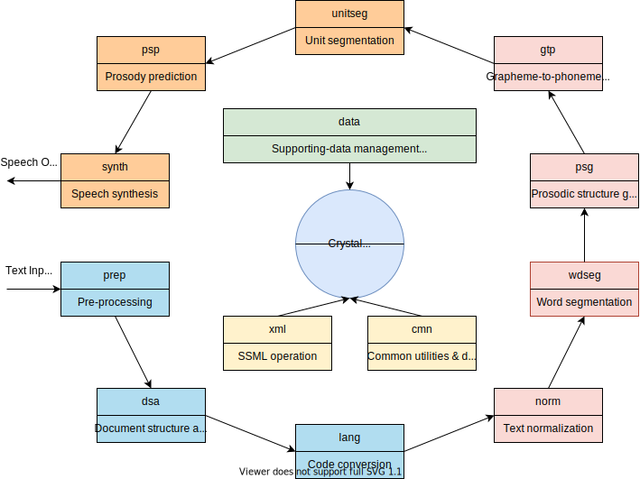

# Crystal Text-to-Speech (TTS) Engine

C++ implementation of Crystal Text-to-Speech (TTS) engine.

The Crystal TTS engine provides an implementation of a unified framework for multilingual TTS synthesis engine – Crystal.  The unified framework defines the common TTS modules for different languages and/or dialects.  The interfaces between consecutive modules conform to Speech Synthesis Markup Language (SSML) specification for standardization, in-teroperability, multilinguality, and extensibility.

  

Please use [the following paper](http://www1.se.cuhk.edu.hk/~hccl/publications/pub/2035_Unified%20Framework.pdf) for reference to this project:

- Zhiyong WU, Guangqi CAO, Helen MENG, Lianhong CAI, "A Unified Framework for Multilingual Text-to-Speech Synthesis with SSML Specification as Interface," Tsinghua Science and Technology, vol. 14, no. 5, pp. 623-630, October 2009.

### About the Project

Copyright (c) Tsinghua-CUHK Joint Research Center for Media Sciences, Technologies and Systems. All rights reserved.

http://mjrc.sz.tsinghua.edu.cn

Tsinghua-CUHK Joint Research Center has the rights to create, modify, copy, compile, remove, rename, explain and deliver the source codes.
